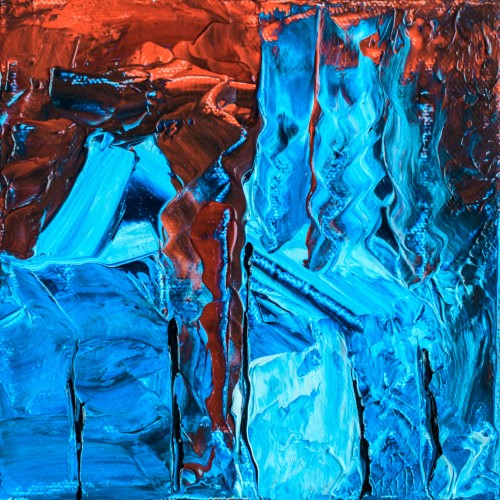
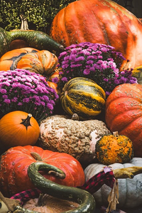
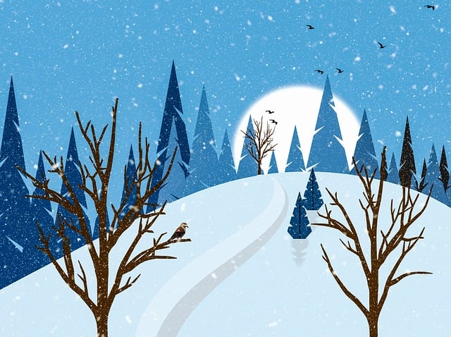

# Test Dokumentation Gruppe 1

## Test 1
| Bildgroesse            | Verkleinerungsgrad | Erwartete Bildgroesse |
|------------------------|--------------------|-----------------------|
| 500p x 500p            | 50%                | 250p x 250p           |

### hochgeladenes Bild:

### zurueckkommendes Bild:

Resultat:
Der Test hat das Bild wie erwartet auf 250p x 250p verkleinert.

Duchgefuehrt am 21.12.2023 10:04

## Test 2
| Bildgroesse            | Verkleinerungsgrad | Erwartete Bildgroesse |
|------------------------|--------------------|-----------------------|
| 427p x 640p            | 50%                | 213.5p x 320p         |

### hochgeladenes Bild:

### zurueckkommendes Bild:

Resultat:
Der Test hat das Bild nicht wie erwartet auf 213.5p x 320p verkleinert. Es hat das Bild auf 200p x 300p verkleinert.

Durchgefuehrt am 21.12.2023 10:16

## Test 3
| Bildgroesse         | Verkleinerungsgrad | Erwartete Bildgroesse |
|---------------------|--------------------|-----------------------|
| 500 x 500p          | 25%                | 125p x 125p           |

### hochgeladenes Bild:

### zurueckkommendes Bild:

Resultat:
Das Bild wurde wie erwartet auf 125p x 125p verkleinert.

Durchgefuehrt am 21.12.2023 10:22

## Test 4
| Bildgroesse            | Verkleinerungsgrad | Erwartete Bildgroesse |
|------------------------|--------------------|-----------------------|
| 640p x 478p            | 75%                | 480p x 358.5p         |

### hochgeladenes Bild:

### zurueckkommendes Bild:

Resultat:
Der Test hat das Bild nicht wie erwartet auf 480p x 358.5p verkleinert. Es hat das Bild auf 450p x 300p verkleinert.

Durchgefuehrt am 21.12.2023 10:32

## Test 5
| Bildgroesse            | Verkleinerungsgrad | Erwartete Bildgroesse            |
|------------------------|--------------------|----------------------------------|
| 500p x 500p            | -50%               | Bild sollte nicht erkannt werden |

### hochgeladenes Bild:

### zurueckkommendes Bild:
-> Gab keines

Resultat:
Wie erwartet hat die Lambda ueberhaupt nichts gemacht, da das Bild nicht erkannt wurde.

Durchgefuehrt am 22.12.2023 17:57

**Tests wurden alle von der Gruppe1 durchgefuehrt.**
